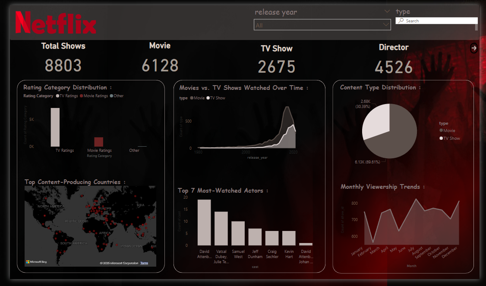

#  Netflix Data Analysis Dashboard

Welcome to my **Netflix Data Analysis Dashboard** project, created using **Power BI**! This project dives deep into Netflix’s extensive content library, uncovering trends and insights that highlight its global content strategy. 

## Project Overview  
In this analysis, I transformed raw Netflix data into meaningful visualizations that provide insights into the platform’s content distribution, popular genres, and influential contributors. This dashboard is designed to help users understand patterns and trends in Netflix's offerings over time and across regions.

##  Key Insights  
The dashboard covers a wide range of analytical perspectives, including:

- **🗕️ Top Genres & Categories**: Discover the most popular genres featured on Netflix.
- **🗕️ Most Featured Actors & Directors**: Identify key figures frequently collaborating with Netflix.
- **🗕️ Title Distribution by Country**: Analyze how Netflix's content is distributed globally.
- **🗕️ Release Trends Over the Years**: Track how Netflix's content production has evolved over time.

##  Tools & Technologies  
- **Power BI**: For data visualization and dashboard creation.  
- **Data Cleaning & Transformation**: Conducted within Power BI using Power Query.

## 📂 Dataset  
The dataset used in this project was sourced from publicly available Netflix data, containing information about titles, genres, release years, countries, cast, and more.

##  How to Use This Dashboard  
1. Download the `.pbix` file from the repository.  
2. Open it using Power BI Desktop.  
3. Interact with slicers and filters to explore different dimensions of the data.

